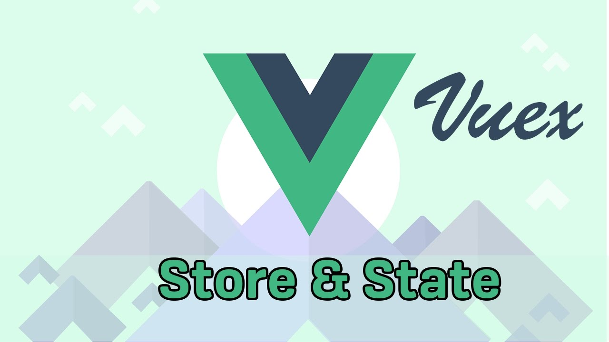

# vuex-tutorials

Working through the Net Ninja Vuex Tutorials on YouTube

# nnvuex-01

>Vuex Tutorial #2 - A Simple Vue App

>Vuex Tutorial #3 - Setting up a Central Store

Net Ninja's [Vuex Tutorial #1](https://www.youtube.com/watch?v=BGAu__J4xoc&list=PL4cUxeGkcC9i371QO_Rtkl26MwtiJ30P2) on YouTube

## Build Setup

``` bash
# install dependencies
npm install

# serve with hot reload at localhost:8080
npm run dev

# build for production with minification
npm run build
```

For detailed explanation on how things work, consult the [docs for vue-loader](http://vuejs.github.io/vue-loader).
